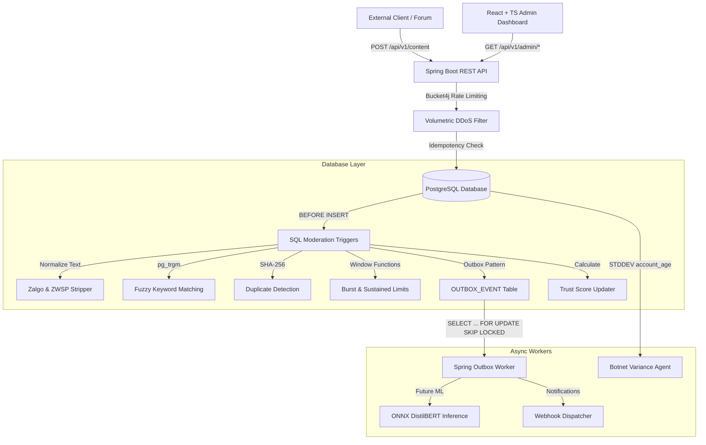

# Shhmods: Moderation-as-a-Service Engine

Shhmods is a lightweight, fully FOSS (Free and Open Source Software) digital content moderation system designed to be seamlessly integrated into external communities (Discord bots, games, forums). 

It automates text moderation and dynamically computes user trust scores directly through a robust combination of database-level logic and a resilient Spring Boot backend, avoiding the need for expensive, opaque external machine learning APIs.

## The Problem

Traditional content moderation relies heavily on costly external ML APIs (like OpenAI or Perspective API) which introduces latency, high operational costs, and "black box" moderation decisions that are difficult to appeal. Additionally, simple keyword filters are easily bypassed using leetspeak (e.g., `b@dw0rd`), zero-width characters, or coordinated botnet swarms.

## The Solution

Shhmods solves this by pushing deterministic, explainable moderation logic down to the database engine. By utilizing PostgreSQL's `pg_trgm` for fuzzy string matching, window functions for rate limiting, and standard deviation checks for botnet variance, Shhmods provides an **auditable** and **highly scalable** solution.

## High-Level Architecture (HLD)



## Key Features & Technical Details

### 1. Database-First Enforcement
- **Why?** Writing rules as triggers guarantees that bad data cannot enter the system, regardless of backend bugs or bypasses. 
- **Fuzzy Matching (`pg_trgm`)**: Catches leetspeak and misspellings by calculating trigram similarity against a `BANNED_WORD` table.
- **Normalization**: A custom PL/pgSQL function strips zero-width spaces and Zalgo text diacritics before matching.
- **Duplicate Hashing**: Content is normalized and hashed (SHA-256). Triggers block 100% exact matches within a rolling 24-hour window.

### 2. Dynamic Trust Scoring & Shadow Banning
- **Why?** Punishing bad actors requires context. A user's "Trust Score" (0-100) dictates their standing.
- **Implementation**: Stored procedures recalculate scores dynamically based on the severity of violations, account age, and accurate reports submitted.
- **Shadow Banning**: If a score drops below the tenant's configured threshold (e.g., 10), the database flips `is_visible = false`. Trolls see their own posts, but the public doesn't, wasting their time without alerting them.

### 3. Resilient API Architecture
- **DDoS Defense**: The Spring layer utilizes **Bucket4j** to enforce a volumetric limit (e.g., 100 requests/minute per IP) to prevent connection pool exhaustion.
- **Idempotency**: All critical `POST` endpoints require an `Idempotency-Key` header, allowing clients to safely retry network timeouts without triggering duplicate moderation penalties.
- **Transactional Outbox**: Moderation events that require external side effects (like sending webhooks or running ML embeddings) are written to an `outbox_event` table. A Spring `@Scheduled` worker polls this table using `SELECT ... FOR UPDATE SKIP LOCKED` for safe, concurrent processing.

### 4. Swatter & Botnet Defense
- **Why?** Malicious users can create 100 fake accounts simultaneously to mass-report a target (Swatting/Brigading).
- **SQL Variance Check**: A scheduled agent queries the `report` table for content receiving 5+ reports in a short window. It calculates the Standard Deviation of the reporters' account creation times. An anomalously low variance (all reporters created on the same day) flags the cluster as a Botnet and ignores the reports.

## How to Use It (Integration Example)

Shhmods operates as a headless **Moderation-as-a-Service API**. You do not build your app *inside* Shhmods; instead, your app (e.g., a Discord Bot, a Forum, or a Game Server) calls Shhmods whenever users interact.

Here is a typical flow for an external application integrating with Shhmods:

1. **User Registration:** When a user joins your community, create an identity for them in Shhmods:
   ```json
   POST /api/v1/users
   { "tenant_id": "YOUR_COMMUNITY", "external_user_id": "discord_12345", "username": "troll_slayer" }
   ```

2. **Content Submission:** Whenever that user sends a message, don't save it to your database immediately. Send it to Shhmods first:
   ```json
   POST /api/v1/content
   Header: Idempotency-Key: <uuid>
   { "tenant_id": "YOUR_COMMUNITY", "user_id": 1, "content_text": "b@dw0rd", "content_type": "CHAT" }
   ```

3. **Enforcement:** Shhmods runs the text through its Postgres-layer triggers (duplicate checks, fuzzy trigram matching, burst rate limits). It immediately responds with the moderation decision:
   ```json
   { "content_id": 99, "is_visible": false, "trust_score": 85.0 }
   ```
   If `is_visible` is `false`, your application simply discards or hides the message. If the user's `trust_score` drops below your configured threshold, Shhmods will flag them as Shadow Banned.

## Quickstart & Deployment

Shhmods is fully containerized and designed for a 1-click deployment via Docker Compose. This single command will spin up the PostgreSQL database, the Spring Boot Backend API, and the React Admin Dashboard (served by Nginx).

### Prerequisites
- **Docker** and **Docker Compose** installed on your host machine.

### 1-Click Deploy

Run the following command from the root of the project:

```bash
docker compose up -d
```

This will:
1. Start a `postgres:15-alpine` container and initialize the database.
2. Build and start the `shhmods-backend` container (exposing the API on port `8080`).
3. Build and start the `shhmods-frontend` container (exposing the Admin Dashboard on port `80`).

You can now access the Admin UI at `http://localhost`.

### Local Development Without Docker

If you prefer to run the components locally for development:

1. **Database:** Ensure PostgreSQL 15+ is running locally on port 5432 with a database named `shhmods`.
2. **Backend:** Run `./gradlew bootRun`
3. **Frontend:** Run `cd admin-ui && npm install && npm run dev`

### Run the API Simulator

Want to see the system under load? We provide a Python script that mimics Normal users, Trolls, and Botnets submitting data to the live API.

```bash
# Requires python3 and requests module
pip install requests
python3 scripts/simulator.py --duration 5 --botnet
```
