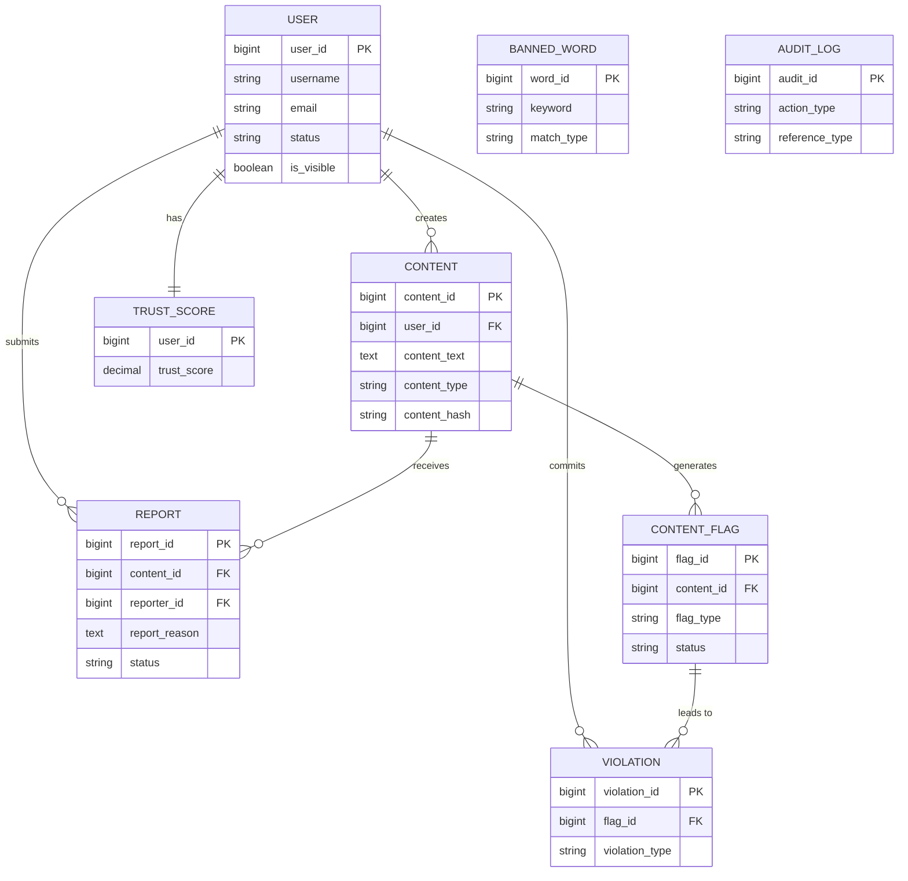

# Shhmods

A lightweight, database-driven digital content moderation system.

Shhmods automates text moderation and dynamically computes user trust scores directly through database-level logic, avoiding the need for heavy external APIs.

## Architecture

- **Migrations First**: Database state is managed purely through Flyway migrations.
- **Integration Testing**: We utilize Testcontainers to spin up ephemeral PostgreSQL 15 instances during integration tests. This ensures that all database triggers, stored procedures, and schema definitions perform identically to a production environment.
- **Security by Default**: The database leverages Row-Level Security (RLS) to enforce data privacy, ensuring that unprivileged roles cannot bypass application logic.

### Relational Schema



## Getting Started

### Prerequisites
- JDK 21+
- Gradle 8.5+ or 9.5+
- Docker (required for Testcontainers)

### Setup & Verification
To verify the database foundation, run the integration tests. This command will automatically pull the necessary PostgreSQL Docker image, start the container, apply all Flyway migrations (`V1` to `V2`), and verify that the core schema, roles, and extensions (like `pg_trgm`) are created correctly.

```bash
./gradlew test
```

### Running the Application
```bash
./gradlew bootRun
```
