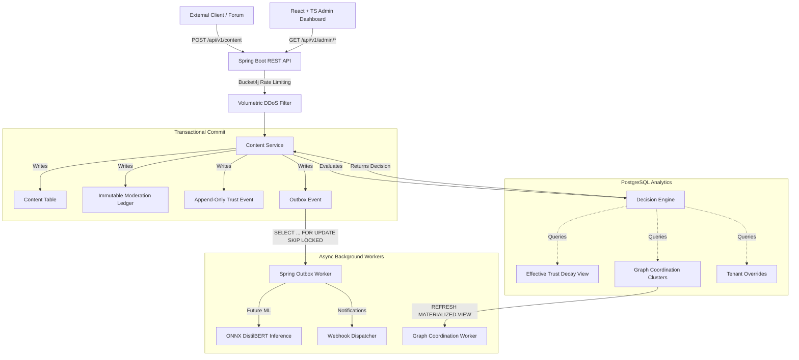

# Shhmods: Orchestrated Moderation Engine

Shhmods is a lightweight, fully open-source digital content moderation system designed to be seamlessly integrated into external communities (Discord bots, games, forums). 

It automates text moderation and dynamically computes user trust scores directly through a robust **Spring Boot Orchestration Engine** backed by **Advanced PostgreSQL Analytics**, avoiding the need for expensive, opaque external machine learning APIs.

## The Problem

Traditional content moderation relies heavily on costly external ML APIs (like OpenAI or Perspective API) which introduces latency, high operational costs, and "black box" moderation decisions that are difficult to appeal. Simple keyword filters are easily bypassed using leetspeak (e.g., `b@dw0rd`), and static point-based reputation systems require constant manual admin intervention. Furthermore, sophisticated botnets easily bypass rate limits by coordinating swarm attacks.

## The Solution

Shhmods solves this by combining the **explainability of a deterministic rules engine** with the **nuance of human forgiveness** and the **scale of graph analytics**. It executes complex moderation workflows entirely within your own infrastructure in milliseconds.

## High-Level Architecture (HLD)



## Key Features & Technical Details

### 1. Orchestrated Decision Engine
- **Why?** Moderation requires deep context. The Spring Boot engine analyzes user history, burst rates, and trust levels before making a decision.
- **Explainability**: Every action (ALLOW, REVIEW, BLOCK) is committed to an immutable `moderation_event` ledger containing the exact signals (e.g., `{"spam_trust": 15.0, "burst_1m": 4}`) that caused the outcome.
- **Fuzzy Matching**: Leverages PostgreSQL `pg_trgm` to calculate trigram similarity, catching leetspeak and obfuscated slurs natively.

### 2. Temporal Trust Decay
- **Why?** People make mistakes. Trust should be lost instantly but regained slowly.
- **Implementation**: Trust scores are not static integers. Shhmods utilizes an append-only `trust_event` ledger to record penalties. An `effective_trust` PostgreSQL View dynamically computes a user's standing on the fly using **exponential decay** (`exp(-decay_rate * time_delta)`). A user who commits a violation automatically regains privileges as time passes, without admin intervention or cron jobs.

### 3. Graph-Based Coordination Detection
- **Why?** Malicious users create botnets to swarm communities with identical spam or mass-report innocent users (Brigading).
- **Implementation**: Asynchronous Spring workers maintain materialized views (`coordination_clusters` and `content_clusters`). If the database detects graph edges forming between users posting identical payload hashes or targeting the same victims, the Decision Engine intercepts their next requests and applies massive coordination penalties.

### 4. Tenant Policy Overrides
- **Why?** Every community has different tolerances. What is spam in one forum is encouraged in another.
- **Implementation**: Tenants can inject JSON bypass policies. If a trusted veteran posts a URL, a tenant policy can intercept the default URL block and override it to `ALLOW`, evaluating the user's specific age and trust metrics in milliseconds.

## How to Use It (Integration Example)

Shhmods operates as a headless **Moderation-as-a-Service API**. You do not build your app *inside* Shhmods; instead, your app calls Shhmods whenever users interact.

1. **User Registration:** Create an identity for a user in Shhmods:
   ```json
   POST /api/v1/users
   { "tenant_id": "YOUR_COMMUNITY", "external_user_id": "discord_12345", "username": "troll_slayer", "email": "user@test.com" }
   ```

2. **Content Submission:** Send user messages to Shhmods first:
   ```json
   POST /api/v1/content
   { "tenant_id": "YOUR_COMMUNITY", "external_user_id": "discord_12345", "username": "troll_slayer", "email": "user@test.com", "content_text": "b@dw0rd", "content_type": "CHAT" }
   ```

3. **Enforcement:** Shhmods runs the text through the Decision Engine (evaluating graph clusters, decay models, and tenant overrides). It immediately responds with the moderation decision:
   ```json
   { "decision": "REVIEW", "reason": "Banned keyword or fuzzy match detected", "signals": {"spam_trust": 95.0} }
   ```

## Quickstart & Deployment

Shhmods is fully containerized and designed for a 1-click deployment via Docker Compose.

### Prerequisites
- **Docker** and **Docker Compose** installed on your host machine.
- Java 21 to build the local JAR.

### 1-Click Deploy

1. Build the backend JAR locally (bypasses Docker network timeouts):
   ```bash
   ./gradlew build -x test
   ```
2. Spin up the infrastructure:
   ```bash
   docker compose up -d --build
   ```

This will:
1. Start a `postgres:15-alpine` database.
2. Build and start the `shhmods-backend` container (API on port `8080`).
3. Build and start the `shhmods-frontend` container (React Dashboard on port `80`).

### Run the API Simulator

Want to see the system under load? We provide a Python script that mimics Normal users, Trolls, and Botnets submitting data to the live API.

```bash
# Requires python3 and requests module
pip install requests
python3 scripts/simulator.py --duration 5 --botnet
```

## Documentation
For deep dives into the architecture, view the official documentation:
- [Platform Overview](docs/architecture/Platform_Overview.md)
- [Trust and Decay Model](docs/architecture/Trust_and_Decay_Model.md)
- [Graph Coordination Engine](docs/architecture/Graph_Detection_Engine.md)
- [Tenant Policy Overrides](docs/architecture/Policy_Overrides.md)
